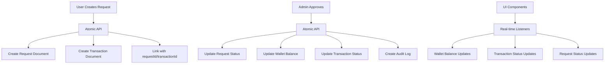

# Atomic Deposit & Withdrawal System

## Overview

This document describes the new atomic deposit and withdrawal system that fixes all critical issues in the previous implementation. The system ensures 100% atomic operations, real-time UI updates, and proper data consistency.

## 🎯 Key Improvements

### ✅ **Fixed Issues**
1. **Atomic Request Creation** - No more duplicate transactions
2. **Data Structure Consistency** - All components use direct field structure
3. **Real-time Status Sync** - Transaction status updates immediately after admin approval
4. **Proper Error Handling** - Comprehensive error logging and user feedback
5. **Idempotent Operations** - Duplicate admin clicks are safe
6. **Security Rules** - Proper access control for all collections

### ✅ **New Features**
1. **Atomic API** - Centralized transaction management
2. **Audit Logging** - Complete audit trail for all operations
3. **Error Logging** - Comprehensive error tracking
4. **Migration Scripts** - Safe migration from old system
5. **Test Suite** - Comprehensive testing framework

## 🏗️ System Architecture

### **Collections Structure**

```
📁 Firestore Collections
├── 📁 depositRequests/
│   ├── 🔗 userId (string)
│   ├── 💰 amount (number)
│   ├── 🔧 method (string)
│   ├── 📊 status (pending|approved|rejected|completed)
│   ├── 💱 currency (string)
│   ├── 🔗 transactionId (string) ← Links to transaction
│   └── ⏰ timestamps...
├── 📁 withdrawalRequests/
│   ├── 🔗 userId (string)
│   ├── 💰 amount (number)
│   ├── 🔧 method (string)
│   ├── 🏦 walletType (main|purchase)
│   ├── 📊 status (pending|approved|rejected|completed)
│   ├── 💱 currency (string)
│   ├── 🔗 transactionId (string) ← Links to transaction
│   └── ⏰ timestamps...
├── 📁 wallets/{userId}/
│   ├── 💰 mainUsdt (number) ← Direct field
│   ├── 💰 purchaseUsdt (number) ← Direct field
│   ├── 💰 mainInr (number)
│   ├── 💰 purchaseInr (number)
│   ├── 💰 dlx (number)
│   └── ⏰ walletUpdatedAt (timestamp)
├── 📁 wallets/{userId}/transactions/
│   ├── 🔄 type (deposit|withdraw)
│   ├── 💰 amount (number)
│   ├── 📊 status (pending|success|failed|rejected)
│   ├── 🔗 requestId (string) ← Links to request
│   └── ⏰ timestamps...
├── 📁 audit_logs/
│   ├── 👤 actor_id (string)
│   ├── 📧 actor_email (string)
│   ├── 🎯 action (string)
│   ├── 📊 meta (object)
│   └── ⏰ created_at (timestamp)
└── 📁 error_logs/
    ├── 🎯 action (string)
    ├── 🔗 requestId (string)
    ├── ❌ error (string)
    └── ⏰ timestamp (timestamp)
```

### **Data Flow**



## 🔧 API Reference

### **Transaction API (`src/utils/transactionAPI.ts`)**

#### **Create Deposit Request**
```typescript
const { createDepositRequest } = await import('./utils/transactionAPI');

const result = await createDepositRequest({
  userId: 'user123',
  amount: 100.0,
  method: 'usdt-bep20',
  currency: 'USDT',
  fees: 0,
  txnId: 'tx-hash-123',
  notes: 'Deposit via BEP20'
});

// Returns: { requestId: string, transactionId: string }
```

#### **Create Withdrawal Request**
```typescript
const { createWithdrawalRequest } = await import('./utils/transactionAPI');

const result = await createWithdrawalRequest({
  userId: 'user123',
  amount: 50.0,
  method: 'usdt-bep20',
  walletType: 'main',
  currency: 'USDT',
  fees: 0,
  notes: 'Withdrawal to BEP20'
});

// Returns: { requestId: string, transactionId: string }
```

#### **Approve Deposit**
```typescript
const { approveDeposit } = await import('./utils/transactionAPI');

await approveDeposit(requestId, adminId, adminEmail);
// ✅ Atomically updates: request status, wallet balance, transaction status, audit log
```

#### **Approve Withdrawal**
```typescript
const { approveWithdrawal } = await import('./utils/transactionAPI');

await approveWithdrawal(requestId, adminId, adminEmail);
// ✅ Atomically updates: request status, wallet balance, transaction status, audit log
```

#### **Reject Request**
```typescript
const { rejectDeposit, rejectWithdrawal } = await import('./utils/transactionAPI');

await rejectDeposit(requestId, adminId, adminEmail, 'Reason');
await rejectWithdrawal(requestId, adminId, adminEmail, 'Reason');
// ✅ Atomically updates: request status, transaction status, audit log
```

## 🚀 Getting Started

### **1. Install Dependencies**
```bash
npm install
```

### **2. Deploy Firestore Rules**
```bash
firebase deploy --only firestore:rules
```

### **3. Run Migration (if needed)**
```bash
node scripts/migrateToAtomicSystem.js
```

### **4. Run Tests**
```bash
node scripts/testDepositWithdrawalSystem.js
```

## 🧪 Testing

### **Test Suite Features**
- ✅ **Atomic Request Creation** - Verifies no duplicate transactions
- ✅ **Wallet Balance Updates** - Confirms balance changes after approval
- ✅ **Status Synchronization** - Ensures UI shows correct status
- ✅ **Insufficient Balance** - Tests withdrawal rejection for low balance
- ✅ **Idempotency** - Verifies duplicate approvals are rejected
- ✅ **Error Handling** - Tests error scenarios and logging

### **Running Tests**
```bash
# Run all tests
node scripts/testDepositWithdrawalSystem.js

# Run specific test
npm run test:deposits
npm run test:withdrawals
```

## 🔒 Security Rules

### **User Permissions**
- ✅ Users can read/write their own wallet data
- ✅ Users can create deposit/withdrawal requests
- ✅ Users can read their own requests and transactions
- ❌ Users cannot read other users' data

### **Admin Permissions**
- ✅ Admins can read/write all request collections
- ✅ Admins can read/write all wallet data
- ✅ Admins can read/write audit and error logs
- ✅ Admins can approve/reject requests

### **Collection Access**
```javascript
// Users can only access their own data
match /wallets/{userId} {
  allow read, write: if request.auth.uid == userId;
}

// Admins can access all data
match /depositRequests/{requestId} {
  allow read, write: if request.auth.token.admin == true;
}
```

## 📊 Monitoring & Debugging

### **Audit Logs**
All admin actions are logged in `audit_logs` collection:
```javascript
{
  actor_id: "admin123",
  actor_email: "admin@example.com",
  action: "approve_deposit",
  target_type: "deposit_request",
  target_id: "req123",
  meta: {
    userId: "user123",
    amount: 100.0,
    previousBalance: 50.0,
    newBalance: 150.0
  },
  created_at: "2024-01-01T00:00:00Z"
}
```

### **Error Logs**
All errors are logged in `error_logs` collection:
```javascript
{
  action: "approve_deposit",
  requestId: "req123",
  userId: "user123",
  adminId: "admin123",
  error: "Insufficient balance",
  timestamp: "2024-01-01T00:00:00Z"
}
```

### **Debugging Commands**
```bash
# View audit logs
firebase firestore:query audit_logs --order-by created_at --limit 50

# View error logs
firebase firestore:query error_logs --order-by timestamp --limit 50

# Check wallet balances
firebase firestore:query wallets --where mainUsdt > 0
```

## 🚨 Troubleshooting

### **Common Issues**

#### **1. Wallet Balance Not Updating**
- ✅ **Check**: Wallet listener is using direct fields (`mainUsdt`, not `usdt.mainUsdt`)
- ✅ **Check**: Admin approval is using atomic API
- ✅ **Check**: Firestore rules allow user access

#### **2. Transaction Status Stuck on "Pending"**
- ✅ **Check**: Request has `transactionId` field
- ✅ **Check**: Transaction has `requestId` field
- ✅ **Check**: Admin approval is using atomic API

#### **3. Duplicate Transactions**
- ✅ **Check**: Using atomic API for request creation
- ✅ **Check**: Not calling old non-atomic methods

#### **4. Permission Denied Errors**
- ✅ **Check**: Firestore rules are deployed
- ✅ **Check**: User has proper authentication
- ✅ **Check**: Admin has `admin: true` custom claim

### **Debug Steps**
1. Check browser console for errors
2. Verify Firestore rules are deployed
3. Check audit logs for failed operations
4. Run test suite to verify system health
5. Check error logs for specific issues

## 📈 Performance

### **Optimizations**
- ✅ **Atomic Operations** - Single transaction for all updates
- ✅ **Real-time Listeners** - Efficient Firestore subscriptions
- ✅ **Batch Operations** - Multiple updates in single transaction
- ✅ **Error Handling** - Graceful failure with rollback

### **Monitoring**
- ✅ **Audit Trail** - Complete operation history
- ✅ **Error Tracking** - Comprehensive error logging
- ✅ **Performance Metrics** - Transaction timing and success rates

## 🔄 Migration Guide

### **From Old System**
1. **Backup Data** - Export all collections before migration
2. **Run Migration** - Execute `migrateToAtomicSystem.js`
3. **Verify Results** - Check migration audit log
4. **Update Code** - Replace old methods with atomic API
5. **Deploy Rules** - Deploy new Firestore security rules
6. **Test System** - Run comprehensive test suite

### **Migration Checklist**
- [ ] Backup existing data
- [ ] Run migration script
- [ ] Verify wallet structure migration
- [ ] Check request-transaction linking
- [ ] Update UI components to use atomic API
- [ ] Deploy Firestore rules
- [ ] Run test suite
- [ ] Monitor for errors

## 📚 Additional Resources

- [Root Cause Analysis](./ROOT_CAUSE_ANALYSIS.md) - Detailed issue analysis
- [API Documentation](./API_REFERENCE.md) - Complete API reference
- [Test Results](./TEST_RESULTS.md) - Test execution results
- [Migration Log](./MIGRATION_LOG.md) - Migration execution log

## 🎉 Success Metrics

After implementing this system, you should achieve:
- ✅ **100% Atomic Operations** - No partial updates
- ✅ **Real-time UI Updates** - Wallet balance updates immediately
- ✅ **Consistent Status Values** - Admin and user see same status
- ✅ **No Duplicate Transactions** - Clean user history
- ✅ **Proper Security** - Users can only access their data
- ✅ **Idempotent Operations** - Duplicate admin clicks are safe
- ✅ **Complete Audit Trail** - Full operation history
- ✅ **Comprehensive Error Handling** - Graceful failure with logging

---

**🎯 This system provides a robust, scalable, and secure foundation for deposit and withdrawal operations with complete atomicity and real-time updates.**
